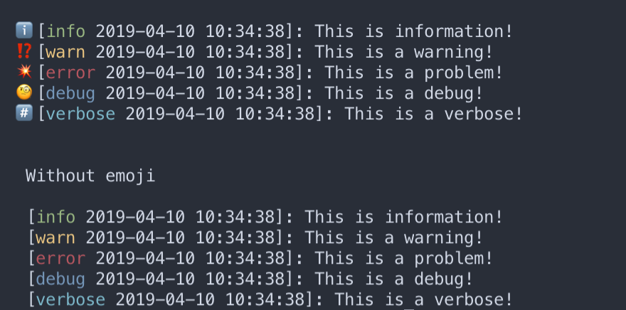

# Hoopa

<p align="center">
  
</p>

## Installation

```shell
$ yarn add hoopa-logger
$ npm install hoopa-logger
```

## Usage

```javascript
import logger from 'hoopa-logger'

logger.info('This is information!')
logger.warn('This is a warning!')
logger.error('This is a problem!')
logger.verbose('This is verbose!')
logger.debug('This is a debug!')
```

### Adding Icons

Hoppa logger supports [node-emoji](https://www.webfx.com/tools/emoji-cheat-sheet/) cheat sheet :rocket:

To add just pass a config object with the emoji name, example:

```javascript
logger.info('This is information!', { emoji: 'information_source' })
```



## Contributing

### 01. Learn more in the Contributing guide

Please take a look at the [contributing guide](.github/contributing.md).

### 02. Fork this project

### 03. Install dependencies

```sh
$ yarn or npm install
```

## Respect earns Respect 👏

Please respect our [Code of Conduct](.github/code-of-conduct.md), in short:

- Using welcoming and inclusive language
- Being respectful of differing viewpoints and experiences
- Gracefully accepting constructive criticism
- Focusing on what is best for the community
- Showing empathy towards other community members

## License

[MIT](license) © 2020 Marcus Silva
